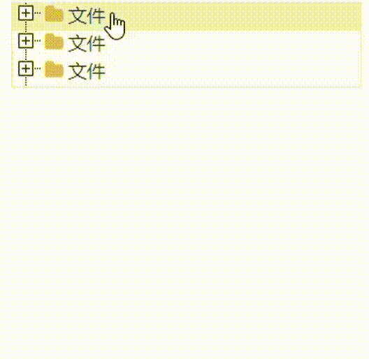

# Vue3-jstree
<!-- Badge -->


<!-- PROJECT LOGO -->
<br />

<p align="center">
  <h3 align="center">Vue3-jstree</h3>

  <p align="center">
    vue3版本的树形目录结构， A tree component for vue3
    <br />
    <a href="https://gavin-yh.github.io/vue3-jstree/"><strong>例子</strong></a>
    <br />
  </p>
</p>

<br />

##  介绍
vue3-jstree是基于vue3的开发的树形文件组件。

目前不支持vue2




<br />

## 安装和使用

### NPM
```bash
npm i vue3-jstree --save
```

按需引用
```base
// index.vue
<template>
  <v-tree
    :data="data"
  />
</template>

<script setup>
import { VTree } from 'vue3-jstree'
import 'vue3-jstree/dist/style.css'

const data = [
  {
    text: "文件",
    children: [
      {
        text: "文件1",
        children: [
          {
            text: "文件1",
          },
          {
            text: "文本3",
            children: [
              {
                text: "文件1",
              },
              {
                text: "文本3",
              },
            ],
          },
        ],
      },
      {
        text: "文件3",
      },
      {
        text: "文件3",
      },
    ],
  },
]
</script>
```

全局组件注册
```base
// index.vue
<template>
  <v-tree
    :data="data"
  />
</template>

<script setup>
const data = [
  {
    text: "文件",
    children: [
      {
        text: "文件1",
        children: [
          {
            text: "文件1",
          },
          {
            text: "文本3",
            children: [
              {
                text: "文件1",
              },
              {
                text: "文本3",
              },
            ],
          },
        ],
      },
      {
        text: "文件3",
      },
      {
        text: "文件3",
      },
    ],
  },
]
</script>


// main.js
import { createApp } from 'vue'
import VTree from 'vue3-jstree'
import 'vue3-jstree/dist/style.css'

createApp(App)
  .use(VTree)
  .mount('#app')
```

