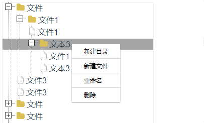

# Vue3-jstree
<!-- Badge -->


<!-- PROJECT LOGO -->
<br />

<p align="center">
  <h3 align="center">Vue3-jstree</h3>

  <p align="center">
    vue3版本的树形目录结构， A tree component for vue3
    <br />
    <a href="https://gavin-yh.github.io/vue3-jstree/"><strong>例子</strong></a>
    <br />
  </p>
</p>

<br />

##  介绍
vue3-jstree是基于vue3的开发的树形文件组件。

目前不支持vue2




<br />

## 安装和使用
### 初始化vue项目
```bash
# npm 6.x
npm init vite@latest my-vue-app --template vue

# npm 7+, 需要额外的双横线：
npm init vite@latest my-vue-app -- --template vue
```
### NPM
安装vue3-jstree
```base
npm i vue3-jstree --save
```

### 按需引用
index.vue template中使用v-tree

```html
// index.vue
<template>
  <v-tree
    :data="data"
  />
</template>
```

index.vue 引入组件，和对应的样式

```ts
<script setup>
import { VTree } from 'vue3-jstree'
import 'vue3-jstree/dist/style.css'

// 声明的数据
const data = [
  {
    text: "文件",
    children: [
      {
        text: "文件1",
        children: [
          {
            text: "文件1",
          },
          {
            text: "文本3",
          },
        ],
      },
      {
        text: "文件3",
      },
    ],
  },
]
</script>
```

### 全局组件注册
在main.js 引入VTree，全局注册
```ts
import { createApp } from 'vue'
import App from './App.vue'

+ import VTree from 'vue3-jstree'
+ import 'vue3-jstree/dist/style.css'

createApp(App)
+  .use(VTree)
   .mount('#app')
```

index.vue template中使用v-tree
```html
// index.vue
<template>
  <v-tree
    :data="data"
  />
</template>
```
index.vue 声明data数据
```ts
<script setup>
const data = [
  {
    text: "文件",
    children: [
      {
        text: "文件1",
        children: [
          {
            text: "文件1",
          },
          {
            text: "文本3",
          },
        ],
      },
      {
        text: "文件3",
      },
      {
        text: "文件3",
      },
    ],
  },
]
</script>
```
## 交流
<br />

<div>欢迎一起交流</div>

